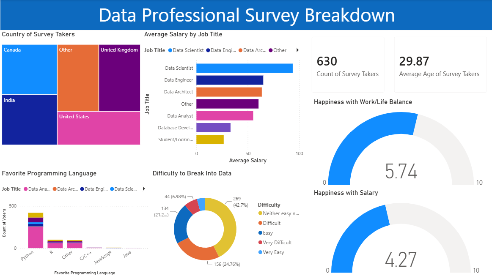

# Data Professional Survey Breakdown Dashboard

## Project Overview
This Business Intelligence project focuses on extracting actionable insights from a global survey of data professionals. The workflow involved data transformation and cleaning using Power Query (handling missing values, structuring demographic brackets, and normalizing survey responses) followed by the creation of an interactive Power BI dashboard to analyze industry trends.

## Dashboard Preview

## Core Analytical Insights
Based on the dashboard visualizations, several prominent trends stand out across the **630 survey respondents**:

### 1. Career & Compensation (Average Salary by Job Title)
* **Data Scientists** command the highest average salary package among respondents, followed closely by **Data Engineers** and **Data Architects**.
* Students or individuals looking to enter the field sit at the lower end of the compensation spectrum, establishing a clear progression of earning potential as technical specialization increases.

### 2. Industry Demographics & Entry Barriers
* **Global Reach:** The data shows widespread participation across key regions, prominently featuring professionals from the United States, India, Canada, and the United Kingdom.
* **Entry Difficulty:** Breaking into the data industry is heavily perceived as a challenge. Over **42.7%** of respondents noted that entering the field is "Neither easy nor difficult," while **24.76%** classified it explicitly as "Difficult."

### 3. Technology Preferences (Favorite Programming Language)
* **Python** dominates as the overwhelming language of choice across almost all data job titles, outstripping R, JavaScript, and Java by a massive margin. 
* This emphasizes Python's status as an industry-standard skill requirement for aspiring data professionals.

### 4. Workplace Sentiment Metrics
* **Work/Life Balance:** Scored a positive **5.74 out of 10**, showing moderate satisfaction across the workforce.
* **Salary Satisfaction:** Scored lower at **4.27 out of 10**, signaling a distinct discrepancy between current compensation rates and employee market expectations.

## Technical Skills Demonstrated
* **Data Transformation:** Power Query for ETL processes, data type formatting, and column filtering.
* **Data Visualization:** KPI cards, Tree Maps, Donut charts, Gauge charts, and stacked column charts.
* **UI/UX Design:** Organized structural layout, consistent brand coloring, and scannable visual hierarchies.
